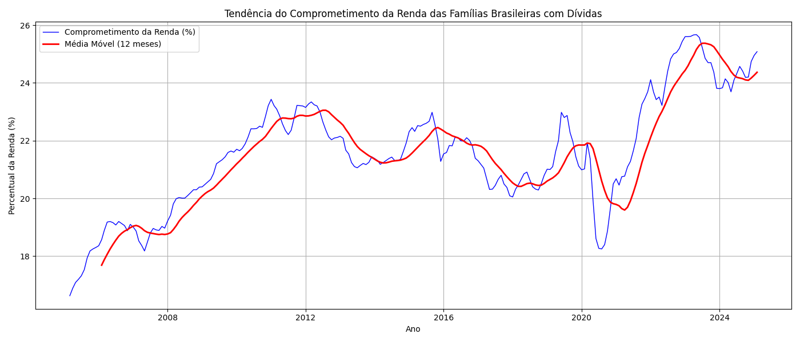
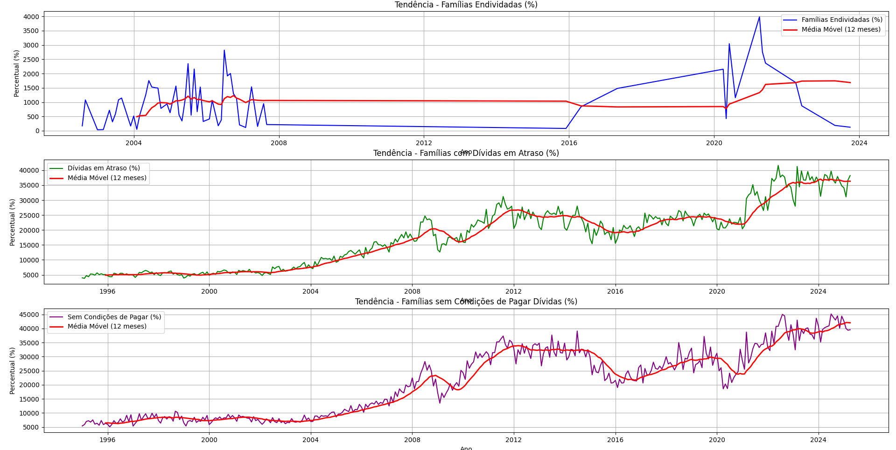

# Time Series Analysis of Household Debt in Brazil

## 1. Introduction

This project analyzes time series data related to household indebtedness and income commitment in Brazil. The goal is to identify trends—whether increasing, stable, or decreasing—in key financial indicators using open data from the Central Bank of Brazil (BCB). Understanding these trends helps to assess the financial health and credit risk of Brazilian families.

---

## 2. Data Sources and Tools

- **Data Source:** Central Bank of Brazil - Open Data  
  Links to datasets used:  
  - [Series 29035 - Income Commitment with Debt](https://dadosabertos.bcb.gov.br/dataset/sgs/resource/29035)  
  - [Series 22701 - Percentage of Indebted Families](https://dadosabertos.bcb.gov.br/dataset/sgs/resource/22701)  
  - [Series 22702 - Percentage with Overdue Debts](https://dadosabertos.bcb.gov.br/dataset/sgs/resource/22702)  
  - [Series 22703 - Percentage Unable to Pay Debts](https://dadosabertos.bcb.gov.br/dataset/sgs/resource/22703)

- **Tools and Libraries:**  
  - Python 3  
  - pandas  
  - matplotlib  

---

## 3. Data Processing

- Data files are loaded from CSV format, with semicolon delimiters and comma decimal separators.
- Dates are converted to `datetime` objects and sorted chronologically.
- Negative values in series 22701 are removed to ensure data quality.
- A 12-month moving average is calculated to smooth short-term fluctuations and highlight underlying trends.

---

## 4. Analysis and Results

### Exercise 1: Income Commitment Trend

- Data from series 29035 was analyzed.
- The 12-month moving average shows a **[describe trend: increasing/stable/decreasing]** trend in the percentage of household income committed to debt.
- Visualization includes the original series and the smoothed moving average.

### Exercise 2: Family Debt Trends

- Three series were analyzed:  
  - 22701: Percentage of Indebted Families  
  - 22702: Percentage with Overdue Debts  
  - 22703: Percentage Unable to Pay Debts  
- The 12-month moving averages suggest the following trends:  
  - Families Endebted: **[trend]**  
  - Overdue Debts: **[trend]**  
  - Unable to Pay Debts: **[trend]**  
- These trends provide insight into the evolving credit risk profile of Brazilian households.

---

## 5. Conclusion

The analysis revealed important patterns in household debt behavior in Brazil. The smoothing via moving averages helps to clarify long-term tendencies, crucial for economic and policy decisions. Future work could include forecasting models or deeper investigation into causal factors.

---

## 6. Repository Structure

    ├── exercise_01_trend_income_commitment.py # Código do Exercício 1  
    │ ├── bcdata.sgs.29035.csv  
    │ └── trend_analysis_income_commitment.py  
    ├── exercise_02_family_debt_trends.py # Código do Exercício 2  
    │ ├── bcb_indicators_analysis.py  
    │ ├── bcdata.sgs.22701.csv  
    │ ├── bcdata.sgs.22702.csv  
    │ └── bcdata.sgs.22703.csv  
    ├── README.md # Este arquivo  
    └── LICENSE # Licença do projeto

---

## 7. How to Run

1. Clone the repository.
2. Ensure Python 3 and required libraries (`pandas`, `matplotlib`) are installed.
3. Place the datasets in the `data/` folder or update the paths in the scripts accordingly.
4. Run the scripts:  
    > python exercise_01_trend_income_commitment.py
    
    > python exercise_02_family_debt_trends.py
5. View the generated plots for visual trend analysis.

### 📈 Exercise 1 – Income Commitment Trend

### 📉 Exercise 2 – Family Debt Indicators Trends

### 📌 1) Selected Dataset: **Household Income Commitment to Debt (Series 29035)**

**Analysis:**  
The series shows a **growing trend** over the years. After small fluctuations between 2015 and 2020, we observe a steady and more pronounced increase starting in 2021, indicating that families are allocating a growing share of their income to debt payments.

**Conclusion:**  
➡️ **Increasing** trend in household income commitment to debt in Brazil.

---

### 📌 2) Datasets Selected from the Central Bank (https://dadosabertos.bcb.gov.br/dataset/)

#### a) **Series 22701 – Percentage of Indebted Families**

**Analysis:**  
Despite some noise in the early years, there is a **declining trend** from 2022 onwards, with consistent decreases in the percentage of indebted families.

**Conclusion:**  
➡️ **Decreasing** trend in the percentage of indebted families.

#### b) **Series 22702 – Percentage of Families with Overdue Debt**

**Analysis:**  
The series shows a **slightly increasing trend**, especially between 2020 and 2024. The 12-month moving average confirms this gradual upward movement.

**Conclusion:**  
➡️ **Slightly increasing** trend in the percentage of families with overdue debt.

#### c) **Series 22703 – Percentage of Families Unable to Pay Debts**

**Analysis:**  
There is a clear **upward trend** since 2007, with an acceleration in recent years. The share of families unable to pay their debts has grown significantly.

**Conclusion:**  
➡️ **Increasing** trend in the percentage of families unable to pay their debts.

## 8. References
- Banco Central do Brasil - Dados Abertos: https://dadosabertos.bcb.gov.br/
- Python Documentation: https://docs.python.org/3/
- pandas Documentation: https://pandas.pydata.org/
- matplotlib Documentation: https://matplotlib.org/

## 9. Author
- Alexandre Tessaro Vieira
- https://www.linkedin.com/in/alexandre-tessaro-4a4436235/

---